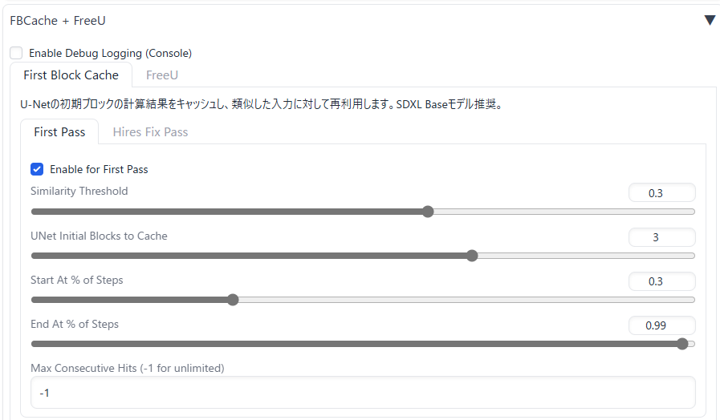

# FreeU_plus_FBCache_for_Forge_Classic
This repository is implementation of FreeU and FBCache for Forge Classic

FBCache is designed specifically for SDXL.


## how to install

Place this repository in your Forge classic extensions directory:

```
cd /path/to/Stable Diffusion WebUI Forge - Classic\extensions

git clone https://github.com/Shiba-2-shiba/FreeU_plus_FBCache_for_Forge_Classic.git

```
## FBCache Tab




## FreeU Tab


